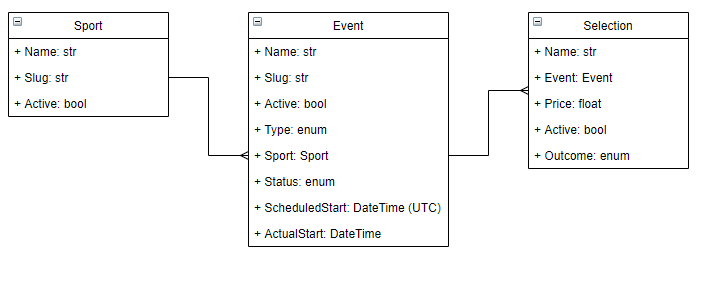

# 888 Solution

[](https://codeclimate.com/github/ShaneNolan/888-solution/maintainability)

## Specifications

Command-line CRUD application demonstrating the following functionalities:

- Creating sports, events or selections.
- Searching for sports, events or selections.
- The system should be able to combine N filters with an AND expression.
- Filters may be more or less complex.
- Updating sports, events or selections.
- A sport may have multiple events.
- An event may have multiple selections.
- When all the selections of a particular event are inactive, the event becomes inactive.
- When all the events of a sport are inactive, the sport becomes inactive.
- Sports, events and selections need to be persistently stored (SQLite is allowed).

## Usage

```bash
Usage: [OPTIONS] COMMAND [ARGS]...

Options:
  --install-completion  Install completion for the current shell.
  --show-completion     Show completion for the current shell, to copy it or
                        customize the installation.

  --help                Show this message and exit.

Commands:
  create-event
  create-selection
  create-sport
  search
  update-event
  update-selection
  update-sport
```

## Usage (Docker)

### Build

```bash
docker compose build
```

### Docker Usage

```bash
docker compose run app [ARGS]

# Example:
docker compose run app create-sport Testing Test
```

## Development

### ER Diagram



### ORM Specification

Since I can't use ORM packages I decided to build my own ORM like app.

#### ORM API Usage

```python
sports = SportModel().select('Name', 'Slug', 'Active').filter('Name', Operators.Equals, 'name').filter('Active', Operators.Equals, 1).execute()
```

#### Filter Operators

- `=`
- `!=`
- `>`
- `<`

## Technical Details

### Data Validation

Data is validated throughout the application using [Pydantic](https://pydantic-docs.helpmanual.io/). If invalid data is supplied an exception is thrown.
[Typer](https://typer.tiangolo.com/) also validates the CLI input.

### SOLID Design Principles

SOLID design principles are adhered too throughtout the application. `BaseModel` is tightly coupled too Mysql but this can be abstracted out through the use of interfaces. `ISchema` is an example of this. If Pydantic was removed for whatever reason it would not affect the application but we would need to implement the required logic, i.e.:

```python
class ISchema(ABC):

    @abstractmethod
    def get_id(self) -> Optional[int]:
        ...

    @abstractmethod
    def set_id(self, id: int) -> None:
        ...

    @classmethod
    @abstractmethod
    def schema_json(cls) -> str:
        ...

    @classmethod
    @abstractmethod
    def construct(cls, **values: Any) -> Any:
        ...

    @classmethod
    @abstractmethod
    def dict(cls) -> Dict[str, Any]:
        ...
```

### Increased readability and maintainbilty with Typing

The application is [typed](https://docs.python.org/3/library/typing.html) throughout and validated using [Mypy](http://mypy-lang.org/).

```bash
$ mypy app
Success: no issues found in 5 source files
```

### Extensible

The application is extensible. A new operator can be added easily by appending it to `Operators` (enum).
For example, a regex filter/operator (`REGEXP`) could be easily added and the CLI, and filter method would implement it automatically.

### Automated Table Creation

If the required Model table doesn't exist then it is automatically created.

## Tests

```bash
pytest tests
================================================================================================================================================================== test session starts ==================================================================================================================================================================
platform win32 -- Python 3.8.0, pytest-5.4.3, py-1.10.0, pluggy-0.13.1
rootdir: C:\888-solution
plugins: mock-3.6.1
collected 20 items

tests\test_cli.py .......                                                                                                                                                                                                                                                                                                                          [ 35%]
tests\test_models.py ...........                                                                                                                                                                                                                                                                                                                   [ 90%]
tests\test_schemas.py ..                                                                                                                                                                                                                                                                                                                           [100%]

================================================================================================================================================================== 20 passed in 3.17s ===================================================================================================================================================================
```

### Docker Persistant Storage Test

```bash
>docker compose build && docker compose run app create-sport Testing Test
[+] Running 1/0
 - Container 888-solution_mysql_db_1  Running                                                                                                                         0.0s
Inserted Sport with ID: 1 successfully.

>docker compose run app create-sport Testing Test
[+] Running 1/0
 - Container 888-solution_mysql_db_1  Running                                                                                                                         0.0s
Inserted Sport with ID: 2 successfully.

>docker compose run app search sport
[+] Running 1/0
 - Container 888-solution_mysql_db_1  Running                                                                                                                         0.0s
Field to filter via: ID
Operator(=, !=, >, <) to filter via: =
Value to filter via: 1
Would you like to add another filter [y/N]: n
Found: [SportSchema(ID=1, Name='Testing', Slug='Test', Active=1)] successfully.
```
